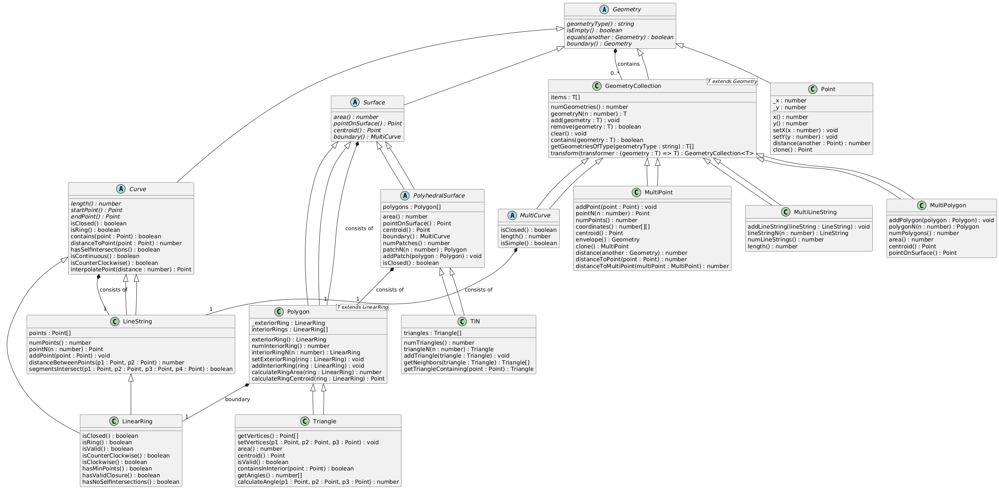

# Main Geometry Hierarchy
```
Geometry (abstract base class)
├── Point
├── Curve (abstract)
│   ├── LineString
│   │   └── LinearRing
├── Surface (abstract)
│   ├── Polygon
│   │   └── Triangle
│   └── PolyhedralSurface
│       └── TIN
└── GeometryCollection<T extends Geometry>
    ├── MultiPoint
    ├── MultiCurve<T extends Curve>
    │   └── MultiLineString
    ├── MultiSurface
    │   └── MultiPolygon
    └── GeometryCollection (generic collections)
```

## Key relationships:

### Point-based:


Point → Geometry
MultiPoint → GeometryCollection<Point>


### Curve-based:


Curve → Geometry
LineString → Curve
LinearRing → LineString
MultiCurve<T> → GeometryCollection<T>
MultiLineString → MultiCurve<LineString>


### Surface-based:


Surface → Geometry
Polygon → Surface
Triangle → Polygon
PolyhedralSurface → Surface
TIN → PolyhedralSurface
MultiSurface → GeometryCollection<Surface>
MultiPolygon → GeometryCollection<Polygon>

### Important notes:

All geometries ultimately inherit from the abstract Geometry base class
Collection classes use generics to maintain type safety
Some classes (like Surface and Curve) are abstract and serve as base classes for more specific implementations
The reference system hierarchy is separate from the geometry hierarchy


<hr>

Geometry (Base abstract class)

```typescript
abstract class Geometry {
    // Core methods
    abstract geometryType(): string
    abstract isEmpty(): boolean
    abstract boundary(): Geometry
    
    // Base geometry methods that can be overridden
    envelope(): Geometry
    equals(another: Geometry): boolean
    asText(): string 
    
    // Spatial Analysis placeholders
    // dimension(): Integer
    // coordinateDimension(): Integer
    // spatialDimension(): Integer
    // SRID(): Integer
    // asBinary(): Binary
    // isSimple(): Boolean
    // is3D(): Boolean
    // isMeasured(): Boolean
    
    // Spatial relationship placeholders
    // disjoint(another: Geometry): Boolean
    // intersects(another: Geometry): Boolean
    // touches(another: Geometry): Boolean
    // crosses(another: Geometry): Boolean
    // within(another: Geometry): Boolean
    // contains(another: Geometry): Boolean
    // overlaps(another: Geometry): Boolean
    // relate(another: Geometry, matrix: String): Boolean
    // locateAlong(mValue: Double): Geometry
    // locateBetween(mStart: Double, mEnd: Double): Geometry
    
    // Analysis placeholders
    // distance(another: Geometry): Distance
    // buffer(distance: Distance): Geometry
    // convexHull(): Geometry
    // intersection(another: Geometry): Geometry
    // union(another: Geometry): Geometry
    // difference(another: Geometry): Geometry
    // symDifference(another: Geometry): Geometry
}
```

Curve (Abstract class extending Geometry)

```typescript
abstract class Curve extends Geometry {
    // New abstract methods
    abstract length(): number
    abstract startPoint(): Point
    abstract endPoint(): Point
    
    // New concrete methods
    isClosed(): boolean
    isRing(): boolean
    
    // Overrides from Geometry
    geometryType(): string  // returns 'CURVE'
    boundary(): Geometry
    isSimple(): boolean
    
    // Additional utility methods introduced
    contains(point: Point): boolean
    distanceToPoint(point: Point): number
    hasSelfIntersections(): boolean
    isContinuous(): boolean
    isCounterClockwise(): boolean
    interpolatePoint(distance: number): Point
}
```

Surface (Abstract class extending Geometry)

```typescript
abstract class Surface extends Geometry {
    // New abstract methods
    abstract area(): number
    abstract pointOnSurface(): Point
    abstract centroid(): Point
    abstract boundary(): MultiCurve
    
    // New concrete methods
    isRegular(): boolean
    isPlanar(): boolean
    hasInteriorRings(): boolean
    contains(point: Point): boolean
    
    // Protected helper methods introduced
    protected isPointOnBoundary(point: Point): boolean
    protected isPointInInterior(point: Point): boolean
    
    // Overrides from Geometry
    geometryType(): string  // returns 'SURFACE'
    isEmpty(): boolean
    isSimple(): boolean  // returns true by default
}
```

MultiCurve (Abstract class extending GeometryCollection<Curve>)

```typescript
abstract class MultiCurve<T extends Curve = Curve> extends GeometryCollection<T> {
    // New abstract/virtual methods
    isClosed(): boolean
    length(): number
    
    // Collection-specific methods
    curveN(n: number): T
    numCurves(): number
    addCurve(curve: T): void
    
    // Overrides from GeometryCollection
    geometryType(): string  // returns 'MULTICURVE'
    boundary(): Geometry
    isSimple(): boolean
    
    // Protected helper methods
    protected isPointOnBoundary(point: Point, curve: T): boolean
}
```

GeometryCollection<T extends Geometry> (Abstract base for collections)

```typescript
abstract class GeometryCollection<T extends Geometry> {
    // Core collection methods
    numGeometries(): number
    geometryN(n: number): T
    
    // Collection manipulation
    add(geometry: T): void
    remove(geometry: T): boolean
    clear(): void
    
    // Query methods
    contains(geometry: T): boolean
    getGeometriesOfType(geometryType: string): T[]
    
    // Overrides from Geometry
    geometryType(): string  // returns 'GEOMETRYCOLLECTION'
    isEmpty(): boolean
    equals(another: Geometry): boolean
    boundary(): Geometry
}
```
These abstract classes form the foundation of the geometric type system, with each adding its own set of operations and requirements that derived classes must implement. Each level in the hierarchy adds more specialized behavior while maintaining the contract established by its parent classes.
The most significant aspects are:

- Geometry provides the base operations all geometric objects must support
- Curve adds methods specific to linear features
- Surface adds methods for areal features
- GeometryCollection provides collection - management functionality
- MultiCurve specializes collections for curve-type geometries


### Diagram




- **Geometry**: Abstract base class for all geometric objects.
- **Curve**: Abstract base class for curve geometries, including methods for length and points.
- **Point**: Represents a geometric point with x and y coordinates.
- **LineString**: Represents a series of connected points (a line), inherits from `Curve`.
- **LinearRing**: A closed `LineString` that forms a ring, used primarily in boundaries.
- **MultiPoint**: A collection of `Point` objects, allows operations on multiple points.
- **MultiLineString**: A collection of `LineString` objects, manages multiple lines.
- **MultiCurve**: Abstract class for a collection of curves, extending `GeometryCollection`.
- **Polygon**: A surface geometry defined by a boundary ring and optional interior holes.
- **MultiPolygon**: A collection of `Polygon` objects, manages multiple polygons.
- **Triangle**: Specialized form of `Polygon` with three sides.
- **Surface**: Abstract base class for surface-like geometries, includes methods for area and centroids.
- **PolyhedralSurface**: A surface geometry made up of connected polygons.
- **TIN**: A specialized form of `PolyhedralSurface` that uses triangular facets.
- **GeometryCollection**: Generic class for managing collections of geometry objects.

# Title

### **Geometry**
  | Modifiers | Return Type | Method Name    | Method Parameters | Description                          |
  |-----------|-------------|----------------|-------------------|--------------------------------------|
  | abstract  | string      | geometryType   |                   | Returns the geometry type as a string. |
  | abstract  | boolean     | isEmpty        |                   | Checks if the geometry is empty.     |
  | abstract  | Geometry    | boundary       |                   | Returns the geometric boundary.      |
  |           | boolean     | equals         | Geometry another  | Checks if another geometry is equal. |
  |           | string      | asText         |                   | Returns the WKT representation.      |

### **Curve**
  | Modifiers | Return Type | Method Name       | Method Parameters | Description                               |
  |-----------|-------------|-------------------|-------------------|-------------------------------------------|
  | abstract  | number      | length            |                   | Returns the curve's length.               |
  | abstract  | Point       | startPoint        |                   | Returns the starting point of the curve.  |
  | abstract  | Point       | endPoint          |                   | Returns the ending point of the curve.    |
  |           | boolean     | isClosed          |                   | Checks if the curve is closed.            |
  |           | boolean     | isRing            |                   | Checks if the curve is closed and simple. |
  |           | boolean     | isSimple          |                   | Checks if the curve does not intersect itself. |
  |           | boolean     | contains          | Point point       | Checks if the curve contains a point.    |
  |           | number      | distanceToPoint   | Point point       | Computes distance from curve to a point. |
  |           | boolean     | hasSelfIntersections |               | Checks if the curve intersects itself.   |
  |           | boolean     | isContinuous      |                   | Checks if the curve is continuous.       |
  |           | boolean     | isCounterClockwise |                  | Checks orientation of the curve.         |
  |           | Point       | interpolatePoint  | number distance   | Interpolates a point along the curve.    |

### **Point**
  | Modifiers | Return Type | Method Name   | Method Parameters | Description                             |
  |-----------|-------------|---------------|-------------------|-----------------------------------------|
  | private   | number      | x             |                   | Gets the x-coordinate.                  |
  | private   | number      | y             |                   | Gets the y-coordinate.                  |
  |           | void        | setX          | number x          | Sets the x-coordinate.                  |
  |           | void        | setY          | number y          | Sets the y-coordinate.                  |
  |           | Point       | clone         |                   | Creates a clone of the point.           |
  |           | number      | distance      | Point another     | Computes distance to another point.     |

- **LineString**
  | Modifiers | Return Type | Method Name           | Method Parameters | Description                             |
  |-----------|-------------|-----------------------|-------------------|-----------------------------------------|
  |           | number      | numPoints             |                   | Returns the number of points in the line.|
  |           | Point       | pointN                | number n          | Gets the nth point of the line.         |
  |           | void        | addPoint              | Point point       | Adds a point to the line.               |
  |           | number      | distanceBetweenPoints | Point p1, Point p2| Computes distance between two points.   |
  |           | boolean     | segmentsIntersect     | Point p1, Point p2, Point p3, Point p4 | Checks if two segments intersect. |

### **LinearRing**
  | Modifiers | Return Type | Method Name           | Method Parameters | Description                            |
  |-----------|-------------|-----------------------|-------------------|----------------------------------------|
  |           | boolean     | isValid               |                   | Validates the linear ring construction.|
  |           | boolean     | isClockwise           |                   | Checks if ring is clockwise.           |
  |           | boolean     | hasMinPoints          |                   | Checks if ring has minimum points.     |
  |           | boolean     | hasValidClosure       |                   | Checks if ring is properly closed.     |
  |           | boolean     | hasNoSelfIntersections|                   | Checks for self-intersections.         |

### **MultiPoint**
  | Modifiers | Return Type | Method Name        | Method Parameters | Description                             |
  |-----------|-------------|--------------------|-------------------|-----------------------------------------|
  |           | number[][]  | coordinates        |                   | Returns coordinates of all points.      |
  |           | Point       | centroid           |                   | Calculates centroid of points.          |
  |           | Geometry    | envelope           |                   | Gets the minimum bounding box.          |
  |           | MultiPoint  | clone              |                   | Clones the MultiPoint.                  |
  |           | number      | distance           | Geometry another  | Computes distance to another geometry.  |

### **MultiLineString**
  | Modifiers | Return Type | Method Name       | Method Parameters  | Description                             |
  |-----------|-------------|-------------------|--------------------|-----------------------------------------|
  |           | void        | addLineString     | LineString lineString | Adds a LineString to the collection. |
  |           | LineString  | lineStringN       | number n           | Retrieves the nth LineString.           |
  |           | number      | numLineStrings    |                    | Returns the number of LineStrings.      |
  |           | number      | length            |                    | Computes total length of all LineStrings. |

### **MultiCurve**
  | Modifiers | Return Type | Method Name       | Method Parameters | Description                               |
  |-----------|-------------|-------------------|-------------------|-------------------------------------------|
  |           | void        | addCurve          | Curve curve       | Adds a curve to the collection.           |
  |           | Curve       | curveN            | number n          | Retrieves the nth curve.                  |
  |           | number      | numCurves         |                   | Returns the number of curves in the collection. |
  |           | number      | length            |                   | Computes total length of all curves.     |

### **Polygon**
  | Modifiers | Return Type | Method Name       | Method Parameters         | Description                            |
  |-----------|-------------|-------------------|---------------------------|----------------------------------------|
  |           | LinearRing  | exteriorRing      |                           | Retrieves the exterior ring.           |
  |           | number      | numInteriorRing   |                           | Returns the number of interior rings.  |
  |           | LinearRing  | interiorRingN     | number n                  | Retrieves the nth interior ring.       |
  |           | number      | area              |                           | Calculates the area of the polygon.    |
  |           | Point       | centroid          |                           | Calculates the centroid of the polygon.|
  |           | Point       | pointOnSurface    |                           | Finds a point guaranteed to be inside the polygon. |
  |           | void        | setExteriorRing   | LinearRing ring           | Sets the exterior ring.                |
  |           | void        | addInteriorRing   | LinearRing ring           | Adds an interior ring.                 |

### **MultiPolygon**
  | Modifiers | Return Type | Method Name       | Method Parameters | Description                                |
  |-----------|-------------|-------------------|-------------------|--------------------------------------------|
  |           | number      | area              |                   | Computes the total area of all polygons.   |
  |           | Point       | centroid          |                   | Calculates the centroid of all polygons.   |
  |           | Point       | pointOnSurface    |                   | Finds a point on the surface of the polygons. |
  |           | void        | addPolygon        | Polygon polygon   | Adds a polygon to the collection.          |
  |           | Polygon     | polygonN          | number n          | Retrieves the nth polygon.                 |
  |           | number      | numPolygons       |                   | Returns the number of polygons.           |

### **Triangle**
  | Modifiers | Return Type | Method Name       | Method Parameters           | Description                            |
  |-----------|-------------|-------------------|-----------------------------|----------------------------------------|
  |           | Point[]     | getVertices       |                             | Retrieves the vertices of the triangle. |
  |           | void        | setVertices       | Point p1, Point p2, Point p3| Sets the vertices of the triangle.     |
  |           | number      | area              |                             | Calculates the area of the triangle.   |
  |           | Point       | centroid          |                             | Calculates the centroid of the triangle.|
  |           | boolean     | isValid           |                             | Checks if the triangle is valid.       |
  |           | boolean     | containsInInterior| Point point                 | Checks if a point is inside the triangle. |
  |           | number[]    | getAngles         |                             | Computes the angles of the triangle.   |
  |           | void        | addInteriorRing   | LinearRing ring             | Prevents adding interior rings to triangles. |

### **Surface**
  | Modifiers | Return Type | Method Name           | Method Parameters  | Description                                 |
  |-----------|-------------|-----------------------|--------------------|---------------------------------------------|
  | abstract  | number      | area                  |                    | Calculates the surface area.                |
  | abstract  | Point       | pointOnSurface        |                    | Finds a point on the surface.               |
  | abstract  | Point       | centroid              |                    | Calculates the centroid of the surface.     |
  | abstract  | MultiCurve  | boundary              |                    | Retrieves the boundary as a MultiCurve.     |
  |           | boolean     | isRegular             |                    | Checks if the surface is regular.           |
  |           | boolean     | isPlanar              |                    | Checks if the surface is planar.            |
  |           | boolean     | hasInteriorRings      |                    | Checks if the surface has interior rings.   |
  |           | boolean     | contains              | Point point        | Checks if a point is contained on the surface. |
  |           | boolean     | isPointOnBoundary     | Point point        | Checks if a point is on the boundary.       |
  |           | boolean     | isPointInInterior     | Point point        | Checks if a point is in the interior.       |
  |           | LineString  | createRayFromPoint    | Point point        | Creates a ray from a point for testing.     |
  |           | boolean     | rayIntersectsCurve    | LineString ray, Curve curve | Checks if a ray intersects a curve.   |

### **PolyhedralSurface**
  | Modifiers | Return Type | Method Name       | Method Parameters  | Description                                |
  |-----------|-------------|-------------------|--------------------|--------------------------------------------|
  |           | number      | numPatches        |                    | Returns the number of polygon patches.     |
  |           | Polygon     | patchN            | number n           | Retrieves the nth patch.                   |
  |           | void        | addPatch          | Polygon polygon    | Adds a polygon patch to the surface.       |
  |           | boolean     | isClosed          |                    | Checks if the surface is geometrically closed. |
  |           | number      | getSlope          | Triangle triangle  | Placeholder for slope calculation.         |
  |           | number      | getAspect         | Triangle triangle  | Placeholder for aspect ratio calculation.  |
  |           | number      | interpolateHeight | Point point        | Placeholder for height interpolation.      |

### **TIN**
  | Modifiers | Return Type | Method Name           | Method Parameters  | Description                                |
  |-----------|-------------|-----------------------|--------------------|--------------------------------------------|
  |           | number      | numTriangles          |                    | Returns the number of triangles.           |
  |           | Triangle    | triangleN             | number n           | Retrieves the nth triangle.                |
  |           | void        | addTriangle           | Triangle triangle  | Adds a triangle to the TIN.                |
  |           | Triangle[]  | getNeighbors          | Triangle triangle  | Finds neighboring triangles.               |
  |           | Triangle    | getTriangleContaining | Point point        | Finds the triangle containing a point.     |

### **GeometryCollection**
  | Modifiers | Return Type        | Method Name    | Method Parameters | Description                                      |
  |-----------|--------------------|----------------|-------------------|--------------------------------------------------|
  |           | void               | add            | T geometry        | Adds a geometry to the collection.               |
  |           | boolean            | remove         | T geometry        | Removes a geometry from the collection.          |
  |           | void               | clear          |                   | Clears all geometries from the collection.       |
  |           | boolean            | contains       | T geometry        | Checks if a specific geometry is in the collection. |
  |           | T[]                | getGeometriesOfType | string geometryType | Filters geometries by type.                   |
  |           | GeometryCollection | transform      | (geometry: T) => T transformer | Transforms each geometry in the collection. |
  |           | number             | numGeometries  |                   | Returns the number of geometries in the collection. |
  |           | T                  | geometryN      | number n          | Retrieves the nth geometry from the collection.   |


# H1 Main Title
## H2 Subtitle
### H3 Section
#### H4 Subsection
##### H5 Minor Section
###### H6 Smallest Heading

Normal paragraph text with *italic* and **bold** formatting.
Use _underscores_ or **asterisks** for emphasis.

Links: [Text](https://example.com) or [Internal Link](#section-id)

---
Horizontal rule above

Lists:
* Unordered list item
* Another item
  * Nested item
  * Another nested item
    * Even deeper nesting

1. Ordered list
2. Second item
   1. Nested ordered
   2. Another nested
      * Mix and match

> Blockquote text
> Multiple lines
>> Nested blockquotes

Code:
Inline `code` snippets

```python
# Code block with syntax highlighting
def example():
    return "Hello World"
```

Tables:
| Header 1 | Header 2 | Header 3 |
|----------|----------|----------|
| Cell 1   | Cell 2   | Cell 3   |
| Col 1    | Col 2    | Col 3    |

Images:


Task Lists:
- [x] Completed task
- [ ] Uncompleted task
- [ ] Another task

Definition Lists:
Term
: Definition
: Another definition

Footnotes:
Here's a sentence with a footnote[^1].
[^1]: This is the footnote content.

Abbreviations:
*[HTML]: HyperText Markup Language
HTML is a markup language.

Subscript: H~2~O
Superscript: X^2^

~~Strikethrough text~~

==Highlighted text==


<details>
<summary>Expandable section</summary>

Hidden content goes here.
</details>

| Left | Center | Right |
|:-----|:------:|------:|
|Left  |Center  |Right  |

```diff
- removed line
+ added line
```

Keyboard keys: <kbd>Ctrl</kbd> + <kbd>C</kbd>

Math (if supported):
$E = mc^2$

$$
\frac{n!}{k!(n-k)!} = \binom{n}{k}
$$

<!-- Comments look like this -->